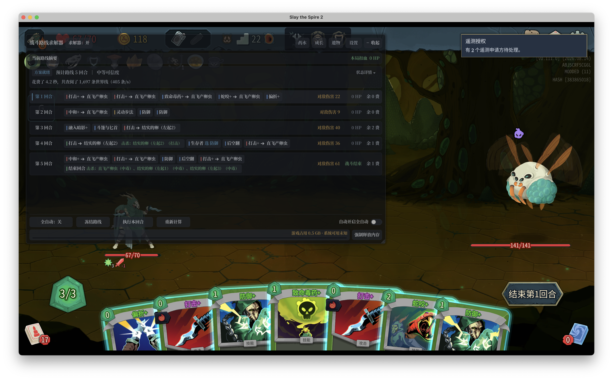
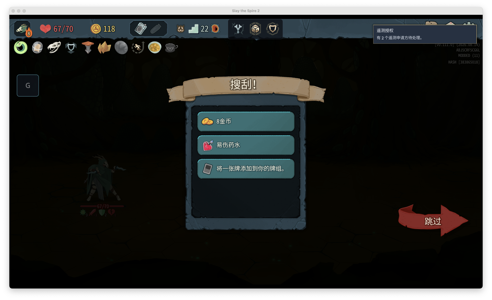

# HextechRunes × CombatSolver Compatibility

**Pinned-version macOS preview / 固定版本 macOS 预览版**

Requires **game0.111.0 / CombatSolver0.48.1 / HextechRunes0.9.7 / RitsuLib0.6.5**. This release rejects other unreviewed binaries, including newer CombatSolver versions. Workshop dependencies auto-update; subscribing to their latest versions alone is insufficient. Obtain **CombatSolver0.48.1 from its author's [official release](https://github.com/Torch1230/CombatSolver/releases/tag/v0.48.1)** and use that local installation with its Workshop copy disabled. Keep exactly one enabled source for each Mod. HextechRunes and RitsuLib must also match the reviewed versions/hashes in [versions.lock.json](versions.lock.json). Windows and a fresh complete run on this candidate are unverified.

必须使用 **游戏0.111.0 / 求解器0.48.1 / 海克斯0.9.7 / RitsuLib0.6.5**。补丁会拒绝未经审阅的新版程序集。工坊依赖会自动更新，单纯订阅最新版不足以满足要求：请从作者的[官方0.48.1发行页](https://github.com/Torch1230/CombatSolver/releases/tag/v0.48.1)获取求解器，启用本地0.48.1并停用其工坊重复来源。海克斯/RitsuLib也须匹配锁定版本和摘要。Windows与当前候选全新整局尚未验证。

**Native mechanism acceptance / 原生机制验收：171/234 strictly verified; remaining checks pending**, plus68 targeted checks and four guards (overlap kept separate).

### What this Mod does

HextechSolverCompat is an independent compatibility Mod for **HextechRunes and CombatSolver**. It lets the solver account for Hextech effects while searching combat routes and executing actions. HextechRunes continues to provide the gameplay; CombatSolver provides search and controls.

The implementation covers all registered player runes, including default-disabled entries obtained through rewards or retained in saves, enemy Hexes, generated cards, enchantments, temporary powers, draw/discard interactions, persistent card growth and effects spanning multiple turns. In the reviewed HextechRunes 0.9.7 catalogue, this includes **371 registered player runes (333 default-selectable) and 136 enabled enemy Hexes after the two exclusions below**. These are implementation coverage figures, not a claim that every possible combination has been played individually.

### Required subscriptions and installation

Subscribe to and enable all four items, then restart the game:

- [CombatSolver](https://steamcommunity.com/sharedfiles/filedetails/?id=3790899961)
- [HextechRunes](https://steamcommunity.com/sharedfiles/filedetails/?id=3747501308)
- [RitsuLib](https://steamcommunity.com/sharedfiles/filedetails/?id=3747602295)
- This compatibility Mod

Keep one active installation of each Mod. If switching from a local development copy to the Workshop version, remove the duplicate from the active Mod list. The package contains only this adapter, its license and documentation; it does not bundle or replace the game or its dependencies.

**BaseLib is optional.** BaseLib, RelicRewardChoices, QuickRestart and MintySpire2 can remain enabled in the tested combination. Disabling them is not an installation requirement.

### Using it

Start the game through Steam, enter a single-player Hextech combat and use CombatSolver to search a route. You can execute the current turn or enable full auto through the solver's controls. Full auto acts in your current run; leave it off if you only want advice.

Search time depends on the combat, available choices, hardware and search budget. This adapter provides compatibility; it does not guarantee an optimal route or a winning run. If it reports an unreviewed effect or patch combination, solving stops for that combat and you can continue manually.

### Compatibility and limitations

- Single-player combat is the supported scope. Multiplayer, the Tony algorithm Mod and prediction outside combat have not been validated.
- Disable the **enemy Hexes `GlobeHead` and `SolidTime`** in HextechRunes settings. These are the two excluded enemy effects. **The player `SolidTime` rune is supported.** Disabling future selection does not remove an effect already present in a saved run; combat containing an excluded effect remains outside solver support.
- Game/dependency updates and additional Mods that change combat callbacks can require a new adapter review. A rejected version is not proof that your save is damaged.
- The tested 11-Mod combination includes CombatSolver, HextechRunes, RitsuLib, this adapter, BaseLib, MintySpire2, QuickRestart, RelicRewardChoices, ImportVanillaSaves, sts2_god_mod and RandomForeseer. This is evidence for that combination, not a blanket guarantee for every BaseLib-dependent Mod or every Mod setting.

### What has actually been tested

The local candidate targets **game 0.111.0, official CombatSolver 0.48.1, HextechRunes 0.9.7 and RitsuLib 0.6.5**, with BaseLib **v3.4.7** in the full 11-Mod combination. All 26 previously omitted registered player runes have native-callback/state implementations. Final same-build tests cover their effects, selected combinations and affected shared mechanisms; exact results and retained failures are in the [testing report](docs/TESTING.md).

**Genuine Steam gameplay:** Warmogs repair 7af8a1 resumed a Silent Ascension 8 floor-22 saved battle, automatically completed it in seven native turns without HP loss (67/70), with all 11 daily Mods and no Lab. Screenshots and native-save readback are retained. This is one saved battle, not a full new run or acceptance of the later registered-rune candidate.

An earlier d589ae build passed 234 native inputs across 98 mechanisms (230 normal checks, four expected rejections), plus three separate checks without BaseLib. These remain historical results, not final-candidate verification.

An earlier installed 0.47.3/0.6.3 build completed Steam combat, normal exit, restart and save resume with all 11 Mods. The user also completed a full three-act Ironclad Ascension 10 win with that build. These are historical gameplay results, separate from the current candidate.

**Current candidate:** adapter8ae924 passed68 targeted native checks (29 registered-rune inputs,10 combination boundaries,29 affected shared checks), plus four refusal/manual-continuation guards. A genuine isolated save copy completed combat in five native turns with21card plays and no HP loss (67/70), all11Mods/noLab/Steam off. Ordinary-Steam install, startup, normal exit/restart and resume preserve the original save and unclaimed rewards.

The current full release matrix has **171 of234 inputs strictly verified**. This count is separate from the68 targeted checks; overlapping inputs are not added into a single total. The remaining matrix inputs are unverified. Visible games were closed on the user's request; the fresh run's first battle and saved reward checkpoint do not establish full-run completion.

**Release validation pending:** the remaining current-build matrix, a fresh complete single-player run and Windows testing. This is a pinned-version macOS preview, not Windows acceptance. The exact supported versions and public native assertions are linked above and in the testing report. Failed inputs and subsequent corrections are retained in the testing report.

### Reporting a problem

Provide your game, adapter and dependency versions, active Mod list, character, relevant rune/Hex names, the first error and reproduction steps. Export CombatSolver's problem bundle from its settings when available. Use [GitHub Issues](https://github.com/tianyilt/HextechSolverCompat/issues), [source](https://github.com/tianyilt/HextechSolverCompat), and the [testing report](docs/TESTING.md).

The adapter adds no upload service or account requirement of its own. The game, CombatSolver and RitsuLib retain their own diagnostics/upload settings. Review problem bundles before posting them publicly; remove credentials, account details and personal file paths.

Thanks to the authors of CombatSolver, HextechRunes, RitsuLib and BaseLib. This is an independently maintained compatibility project, not an official release from those authors. Its own source uses the MIT license.

---

## 中文说明

### 这个 Mod 做什么

HextechSolverCompat 是独立的 **海克斯与战斗求解器兼容 Mod**，让求解器在搜索路线和执行出牌时计入海克斯效果。海克斯仍负责原玩法，战斗求解器负责搜索和操作界面。

适配范围包括全部登记玩家符文（含默认关闭但可由奖励获得或保留在存档中的符文）、敌方海克斯、生成牌、附魔、临时能力、抽弃牌联动、永久卡牌成长和跨回合效果。以已审阅的海克斯0.9.7清单为准，代码已接入 **371个登记玩家符文（333个默认可选），以及扣除下述两项限制后的136个启用敌方海克斯**。这是实现覆盖数，不表示每种组合都单独打完了一局。

### 需要订阅什么、怎么安装

订阅并启用以下四项，然后重新启动游戏：

- [战斗求解器 CombatSolver](https://steamcommunity.com/sharedfiles/filedetails/?id=3790899961)
- [海克斯 HextechRunes](https://steamcommunity.com/sharedfiles/filedetails/?id=3747501308)
- [RitsuLib](https://steamcommunity.com/sharedfiles/filedetails/?id=3747602295)
- 本兼容补丁

每个Mod保持一个启用来源。如果从本地开发副本切换到工坊版，先从启用列表移除重复副本。补丁包只包含本适配器及其许可、说明，不捆绑或替换游戏与依赖。

**BaseLib为可选框架。** 在已测试组合中，BaseLib、RelicRewardChoices、QuickRestart、MintySpire2可以保留开启；安装本补丁不要求停用它们。

### 怎么使用

从Steam启动游戏，进入海克斯单人战斗，用求解器搜索路线。可以执行当前回合，也可以在求解器界面开启全自动。全自动会在当前存档实际操作；只想看建议时保持关闭即可。

搜索耗时取决于战斗局面、可选动作、硬件和搜索预算。本补丁提供兼容，不保证每场都搜到最优路线或必定通关。遇到尚未审阅的效果或补丁组合时，会停止本场求解，你仍可以手动继续。

### 兼容范围与限制

- 支持范围是单人战中求解。联机、东尼算法和战前预测尚未验收。
- 在海克斯设置中禁用敌方 **`GlobeHead`与`SolidTime`**，这是两项已排除的敌方效果。**玩家符文`SolidTime`已支持。** 禁用后续抽选不会移除旧存档已持有的效果；仍带这些敌方效果的战斗不在求解支持范围内。
- 游戏、依赖更新，或其他Mod修改战斗回调后，可能需要重新适配。版本被拒绝不代表存档已经损坏。
- 已测试的11-Mod组合为：CombatSolver、HextechRunes、RitsuLib、本补丁、BaseLib、MintySpire2、QuickRestart、RelicRewardChoices、ImportVanillaSaves、sts2_god_mod、RandomForeseer。这证明的是该组合，不代表所有BaseLib依赖Mod或所有设置都已验证。

### 实际测试过什么

本地候选固定 **游戏0.111.0、官方CombatSolver 0.48.1、海克斯0.9.7、RitsuLib 0.6.5**，完整11-Mod组合保留 **BaseLib v3.4.7**。遗漏的26个登记玩家符文均已接原生回调和分支状态。最终同构建检查覆盖其真实效果、选择组合及受影响共享机制；确切结果、失败与重测以[测试报告](docs/TESTING.md)为准。

**真实Steam实战：** 狂徒专项版7af8a1继续猎手进阶8、第22层存档，7个原生回合自动获胜、实际无伤、最终67/70；11个日常Mod全部保留，无Lab。实际截图及存档回读已保留。这是一场存档战斗，不是全新整局或后来26项候选的验收。

较早d589ae构建通过98类机制、234原生输入（230正常、4预期拒绝），另有3项无BaseLib检查。均按原版本保留，不冒充最终候选。

较早安装的0.47.3/0.6.3版本已在11个Mod同时加载时完成Steam战斗、正常退出、重开及读档。用户还用该版本完成铁甲战士进阶10三幕胜利。这些是历史实战结果，与当前候选的验收分开记录。

**当前候选：** 8ae924通过68专项原生检查（29登记符文输入、10组合边界、29共享回归），另4项拒绝/手动续玩守卫通过；真实存档独立副本5回合21次出牌无伤67/70，全11Mod/无Lab/Steam关闭。普通Steam安装、启动、正常退出重开及原奖励读档均通过，原角色、牌组、遗物、地图与未领取奖励保持。

当前完整发行矩阵已有 **171/234项严格核验通过**，与68专项分开记录，不将重叠输入累加。其余矩阵输入尚未验完。可见游戏已按用户要求关闭；新局首战及保存的奖励检查点不能代替完整整局验收。

**发布验收待完成：** 剩余当前机制矩阵、全新完整单人局及Windows测试。本页是固定版本macOS预览版，不承诺Windows支持；确切版本和公开证据已提供，测试报告保留失败输入与后续修正。

### 怎么反馈问题

请附游戏、补丁和依赖版本、启用Mod列表、角色、相关符文或敌方海克斯名称、最早错误及复现步骤；可用时从求解器设置导出“问题包”。[公开源码与反馈](https://github.com/tianyilt/HextechSolverCompat)、[测试报告](docs/TESTING.md)。

本适配器没有增加自己的上传服务或账号要求。游戏、求解器和RitsuLib仍使用各自的诊断、上传设置。公开问题包前请检查内容，移除凭据、账号资料和个人文件路径。

感谢CombatSolver、HextechRunes、RitsuLib、BaseLib作者。本项目独立维护，不是上述作者的官方发行。我们自己的源码使用MIT许可。

---

