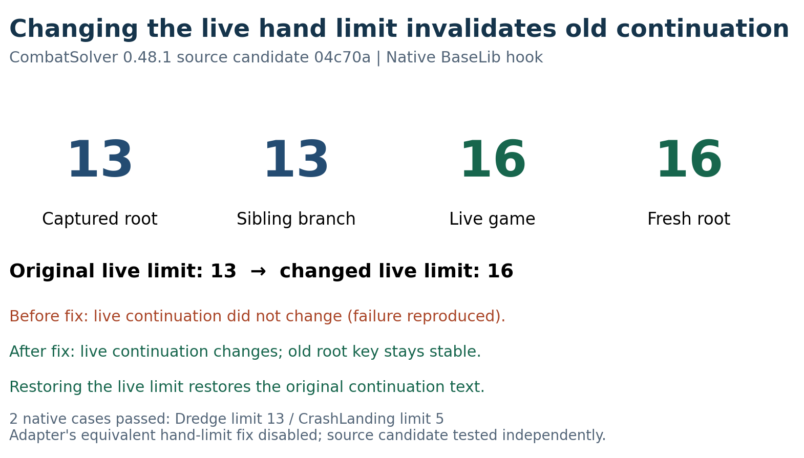
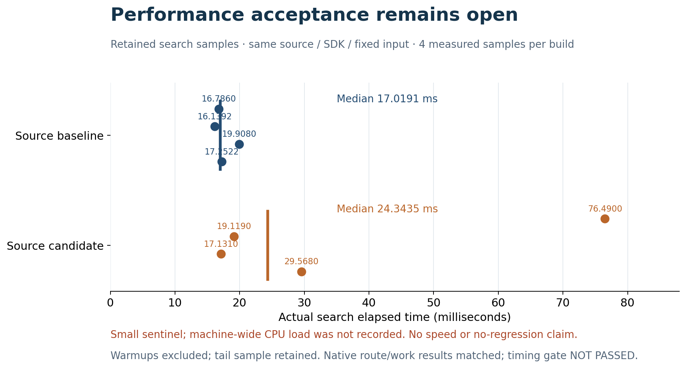

# Public screenshots and captions / 截图与图注

## 新版登记符文候选：真实副本路线 / Current registered-rune candidate

**中文：** 适配器8ae924、Solver0.48.1、Hextech0.9.7、Ritsu0.6.5，全11Mod/无Lab。真实Steam战斗前存档复制到独立数据目录，Steam关闭；5回合零战损路线，随后真实执行。遥测提示来自RitsuLib，兼容补丁未新增上传服务。

**EN:** Adapter8ae924 with Solver0.48.1, Hextech0.9.7 and Ritsu0.6.5; all11Mods, noLab. A genuine pre-combat Steam save was copied into an isolated profile with Steam off. Five-turn zero-loss route, subsequently executed by the native game. The telemetry prompt belongs to RitsuLib; the adapter adds no upload service.

**中文：** 同版本真实执行5回合、21次出牌，奖励界面67/70；没有领取奖励。这是独立副本的一场实际战斗，不是普通Steam战斗或全新整局证明。

**EN:** Native execution completes five turns and21card plays, reaching rewards at67/70HP. No reward was selected. This is one genuine battle in an isolated copy, separate from normal-Steam startup/restart and complete-run acceptance.

## 通用手牌上限 PR 图片 / Generic hand-limit PR figures

**中文：** 根据PR独立源码候选的原生日志生成，真实BaseLib上限13→16，旧根/兄弟仍13、新根16，续算正确失效及恢复。Dredge13和CrashLanding5两项功能检查通过，兼容层同项修复关闭；不以海克斯实战截图代替PR验证。

**EN:** Derived from independent source-candidate native evidence. Real BaseLib limit13→16; old root/sibling stay13, fresh root16; continuation changes and restores. Two functional checks pass with the adapter's equivalent fix disabled. Not a gameplay screenshot or performance acceptance.

**中文：** 按逐请求源数据重算，展示每版4个计时和全部尾部样本。耗时验收未通过；机器后台负载未测，不能据此证明无退化或把耗时差归因于代码。

**EN:** All four measured searches per source build, including the tail; medians recomputed from retained samples. Timing gate NotPassed; machine-wide background load was not recorded, so no no-regression or causal-regression claim is made.

复现两张图：`uv run --with matplotlib==3.10.7 python tools/render_pr_review_figures.py`。源文件和图片摘要见[图片摘要](../evidence/image-provenance.json)。/ Rebuild using the command above; source and image hashes are retained in the manifest.
